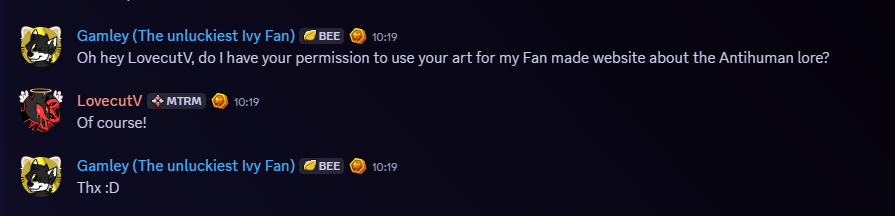

# [ANTIHUMAN LORE WEBSITE](https://gamley.github.io/Antihuman-Lore-Website/)

## Overview

This Website compiles all the Antihuman Lore into bref paragraphs for easy understanding of the lore. 

##  What's included

### Homepage:

- Most recent Antihuman Lore 
- List of sources 
- A form to be a "Lab Rat"
- Table of The roots 

### Video Lore: 

**A bref paragraph on the folowing:**
- ANTIHUMAN 
- DATA_REJECT 
- LAB RAT 
- CYBERNETIC HEART 
- ANTIVILLAIN 
- HYPNOFREAK
- Y2K 
- THE RINGMASTER 

### Character lore:

**A bref paragraph on the folowing:**
- Moka
- Gran
- Florret
- Morale
- Vanilla Milkshake
- Ki
- Daryl Candi
- Cosmo
- Taw
- Dandolin
- Ziggy
- Versatile
- Plushlie
- Gossip Girls

## Files

```
├── Homepage.html               # Main homepage
├── VideoLore.html              # Video lore 
├── CharLore.html               # Character lore
├── styles.css                  # Stylesheet for the Lore website
└── Images/                     # Images files 
    ├── Images :0 

```
## How to view

### Local:

**Steps to view the website:**

- Download the .zip
- Unzip the .zip 
- open the homepage.html in your web-browser

### Web-browser:

**Steps to view the website:**

- Open your web-browser
- Type "*Add link here*" 


## sources

### Images


### Code snippets

**Form code:** https://github.com/deweydex/HTML-CSS-SQL-JS

**Table code:** https://www.w3schools.com/html/html_tables.asp


## Credit

 ### Cybernetic Heart written by MeloditeCat
    

Hello this is a test :D
