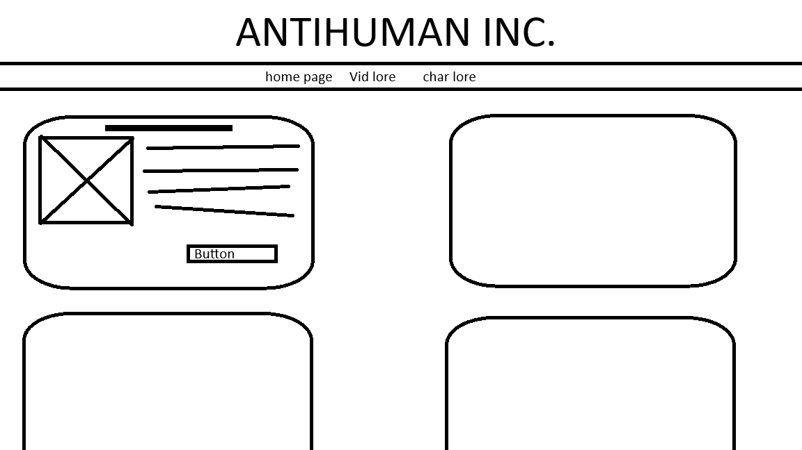

# **ANTIHUMAN LORE WEBSITE**

## **Overview**

This Website compiles all the Antihuman Lore into bref paragraphs for easy understanding of the lore.

## **What I want to included**

### Homepage: 

- Stuff related to the most recent Antihuman lore. (Lab Rat)
- A non-working Form
- Table of The Roots
- Sources used

### Vido Lore: 

A bref paragraph on the all the Antihuman songs

### Character lore:

A bref paragraph on the all the Antihuman charactors

## **Design**

### nav:

I plan to make the nake under the main header so it's easy to see and access.

###  planned layout:
I plan to stick to the Antihuman colour scheme.
I plan to have each topic in it's own box so they're broken up. 

## **History of HTML and CSS** 

### HTML:

HTML is a hypertext markup language used for web develent. It defines the content and structure.

CSS and java are ofen used alongside HTML 

- The creator of HTML is Tim Berners-Lee
- It was first released in the 1990s 
- HTML 3.2 was published in Jan 1997 and HNML 4.0 in dec 1997 as a W3C Recommendation
- HTML 5 was published in 2014

### CSS:
CSS is a style langguage, used for specifying the style of a website or document made in HTML.

- The creator of CSS is Håkon Wium Lie
- It was first released in 1996
- CSS2.1 was published on the on 7 June 2011
- There is no plans for a CSS 4 as of now

## **HTML tags**
**&lt;Head&gt;:**
Surround header material such as titles, CSS info, and company slogans.

**&lt;IMG&gt;:**
Used to display an image.

**&lt;P&gt;:**
  Used for paragraphs.

**&lt;H1&gt;,&lt;H2&gt;,...:**
  A heading line that is used to mark the sections of a document.

## **CSS tags**
**Color:**
Used to give text colour.

**Background-Image:**
Used to set the backround to an image.

**.Form:**
Targets everything with the class "Form"

**#Content:**
Targets everything with the Id "content"

## **Sources**

History of Html: https://en.wikipedia.org/wiki/HTML#History

History of CSS: https://en.wikipedia.org/wiki/CSS

History of HTML and CSS: https://www3.cs.stonybrook.edu/~pfodor/courses/CSE316/L03-HTML_CSS.pdf

